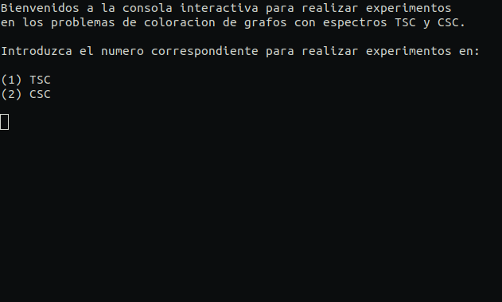

# Spectrum Graph Coloring

``PySGColoring`` es un libreria en Python que brinda herramientas para resolver los problemas de coloracion grafos con espectros TSC y CSC.

``iconsole`` es una util y sencilla consola interactiva que permite experimentar con los problemas de coloracion grafos con espectros TSC y CSC.

## Instalacion

Descargar del repositorio de GitHub.

```bash
git clone https://github.com/julioc1p/SpectrumGraphColoring.git
```

## Uso

### Libreria

```python
import PySGColoring

graph = PySGColoring.random_graph(4, 0.5) # crea un grafo de 4 vertices con densidad 0.5
spectrum = PySGColoring.make_spectrum(3) # crea un espectro de 3 colores
wfunction = PySGColoring.inv_pow2 # toma la funcion de decremento exponencial de base 2
wmatrix = PySGColoring.make_w(spectrum, wfunction) # crea una matriz de interferencias entre cada color usando la funcion dada
vm = PySGColoring.VertexMergeGraphColoring(graph, spectrum, wmatrix) # crea una clase que brinda solucion a TSC y CSC basada en Vertex Merge
vm.ThresholdSpectrumColoring(3) # returna '(0.5, {'1': '1', '2': '3', '3': '3', '4': '1'})', umbral y coloracion para TSC usando VM
vm.ChromaticSpectrumColoring(1) # returna (2, {'1': '1', '2': '2', '3': '2', '4': '1'}), numero cromatico y coloracion para CSC usando VM
```

### Consola interactiva

```bash
python iconsole.py
```


## Dependencias

* ``numpy`` >= v1.16.2

* ``json`` >= v2.0.9

* ``stopwatch`` >= v1.0.1
